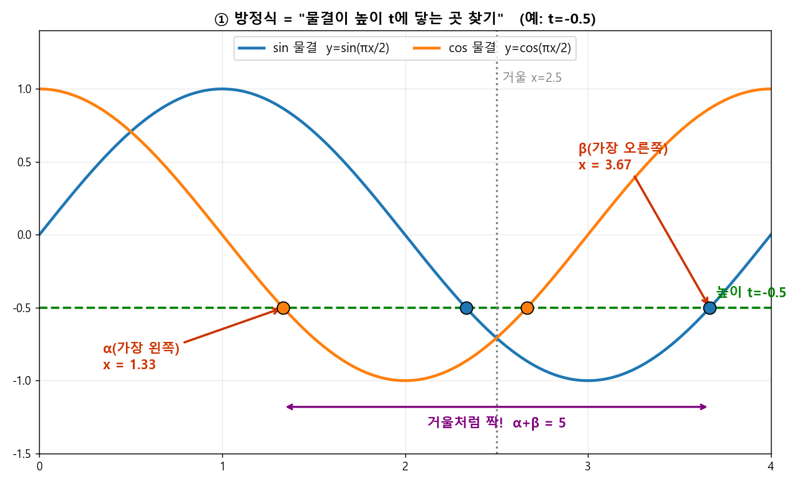
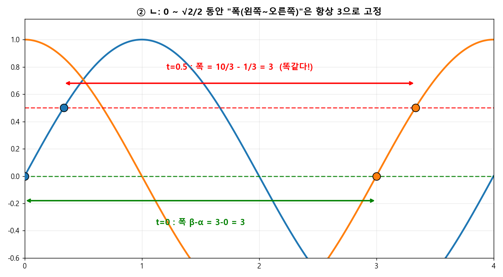
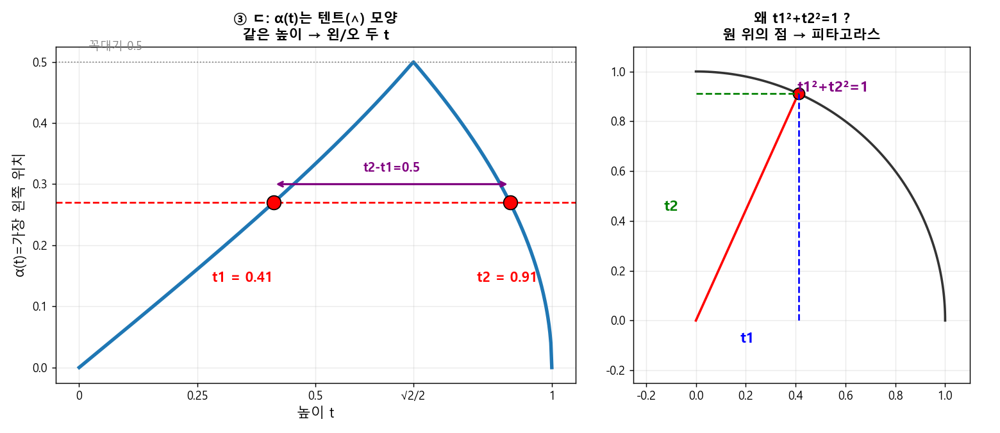

# 🧩 q437  ⭐ 최고난도 (평가원 기출)

> 단원: **삼각함수 — $\alpha(t),\beta(t)$ 함수 분석** · 형태: **보기(ㄱㄴㄷ) 판별** · **정답: ② ㄱ, ㄴ**

## 🔗 원본 (sources, 불변 — 링크만)
- 문제: [사진](https://github.com/fabelian/math-learning-wiki/blob/main/sources/math/2026/06/2026-06-14-q437.jpg)
- 문제 텍스트: [원본 .md](https://github.com/fabelian/math-learning-wiki/blob/main/sources/math/2026/06/2026-06-14-삼각함수-최고난도.md)

## 🎯 문제
$-1\le t\le1$. 방정식 $\left(\sin\frac{\pi x}{2}-t\right)\left(\cos\frac{\pi x}{2}-t\right)=0$ 의 실근 중 $0\le x<4$에 있는 **가장 작은 값 $\alpha(t)$**, **가장 큰 값 $\beta(t)$**. ㄱㄴㄷ 중 옳은 것.

---

## 🧱 0단계 — 그림부터 그리자 (가장 중요)

곱이 0이니 **둘 중 하나가 0**: $\sin\frac{\pi x}{2}=t$ **또는** $\cos\frac{\pi x}{2}=t$.

> 🖼️ **핵심 그림:** 방정식 풀기 = "$\sin$·$\cos$ 물결이 높이 $t$(초록 가로줄)에 **닿는 점** 찾기". 닿는 점의 $x$좌표가 실근, 가장 왼쪽 = $\alpha$, 가장 오른쪽 = $\beta$. **거울 $x=2.5$가 $\sin$↔$\cos$을 바꿔서** 양 끝이 짝 → $\alpha+\beta=5$.

두 함수 모두 **주기가 4**다($\frac{2\pi}{\pi/2}=4$). 그래서 $0\le x<4$는 **딱 한 주기**. 기준점만 외우면 끝:

| $x$ | 0 | 1 | 2 | 3 |
|----|----|----|----|----|
| $\sin\frac{\pi x}{2}$ | 0 | **1** | 0 | **−1** |
| $\cos\frac{\pi x}{2}$ | **1** | 0 | **−1** | 0 |

- $\sin\frac{\pi x}{2}=t$ 의 두 해는 **$x=1$ 기준 좌우대칭**(또는 $x=3$ 기준).
- $\cos\frac{\pi x}{2}=t$ 의 두 해는 **$x=0,4$(즉 양 끝)** 또는 **$x=2$ 기준 대칭**.

핵심 도구 **딱 하나**: $\boxed{\arcsin t+\arccos t=\dfrac{\pi}{2}}$ (이게 ㄱ·ㄴ을 다 푼다).

> $\theta=\frac{\pi x}{2}$로 두면 $x=\frac{2}{\pi}\theta$. 즉 "각도 → $x$"는 $\times\frac{2}{\pi}$.

---

## ▶ ㄱ.  $-1\le t<0$ 이면 $\alpha+\beta=5$  → **참 ✅**

$t<0$일 때 해의 위치:
- $\cos\frac{\pi x}{2}=t\ (<0)$: $\cos$이 음수인 구간 $x\in(1,3)$. 두 해 = $x_1=\frac{2}{\pi}\arccos t\in(1,2)$ 와 $4-x_1\in(2,3)$.
- $\sin\frac{\pi x}{2}=t\ (<0)$: $\sin$이 음수인 구간 $x\in(2,4)$. 두 해 = $(2,3)$과 $(3,4)$에 하나씩, 큰 쪽 $=4+\frac{2}{\pi}\arcsin t\in(3,4)$.

가장 작은 값 = $\cos$쪽 $(1,2)$ → $\alpha=\dfrac{2}{\pi}\arccos t$.
가장 큰 값 = $\sin$쪽 $(3,4)$ → $\beta=4+\dfrac{2}{\pi}\arcsin t$.

$$\alpha+\beta=4+\frac{2}{\pi}\big(\arccos t+\arcsin t\big)=4+\frac{2}{\pi}\cdot\frac{\pi}{2}=4+1=\boxed{5}\ ✅$$

> **왜 항상 5인가?** $t$가 변해도 $\arcsin t+\arccos t$는 **언제나** $\frac\pi2$로 고정이라, $t$가 사라진다. 이게 이 문제의 심장.

---

## ▶ ㄴ.  $\{t:\beta-\alpha=\beta(0)-\alpha(0)\}=\{t:0\le t\le \frac{\sqrt2}{2}\}$ → **참 ✅**

> 🖼️ $t=0$이든 $t=0.5$든 "가장 왼쪽~가장 오른쪽 **폭**"이 똑같이 **3**. 가로줄을 $0\sim\frac{\sqrt2}{2}$로 올려도 거울 대칭이라 폭이 고정된다.

**기준값 $\beta(0)-\alpha(0)$ 먼저.** $t=0$: 해는 $\sin=0$에서 $x=0,2$, $\cos=0$에서 $x=1,3$ → 전체 $\{0,1,2,3\}$. 그래서 $\alpha(0)=0,\ \beta(0)=3$, **기준값 $=3$**.

이제 $\beta(t)-\alpha(t)=3$ 인 $t$를 전부 찾는다. **$t$의 부호로 나눈다.**

**(i) $t<0$:** ㄱ에서 $\alpha=\frac2\pi\arccos t=1-\frac2\pi\arcsin t,\ \beta=4+\frac2\pi\arcsin t$.
$$\beta-\alpha=3+\frac{4}{\pi}\arcsin t<3\quad(\arcsin t<0)\ \Rightarrow\ \text{불가}.$$

**(ii) $t=0$:** $\beta-\alpha=3$ ✅ (포함).

**(iii) $t>0$:** 해 4개 = $\sin$쪽 $a_1=\frac2\pi\arcsin t,\ a_2=2-a_1\in(0,2)$, $\cos$쪽 $b_1=\frac2\pi\arccos t\in(0,1),\ b_2=4-b_1\in(3,4)$.
가장 큰 값은 항상 $\beta=b_2=4-\frac2\pi\arccos t$. 가장 작은 값은 $\alpha=\min(a_1,b_1)$.
$\arcsin t$ vs $\arccos t$ 비교 → 갈림목은 $t=\frac{\sqrt2}{2}$ (둘 다 $\frac\pi4$):

- **$0<t\le\frac{\sqrt2}{2}$:** $\arcsin t\le\arccos t$ → $\alpha=a_1=\frac2\pi\arcsin t$.
$$\beta-\alpha=4-\frac2\pi(\arccos t+\arcsin t)=4-\frac2\pi\cdot\frac\pi2=4-1=3\ ✅$$
- **$\frac{\sqrt2}{2}<t\le1$:** $\alpha=b_1=\frac2\pi\arccos t$.
$$\beta-\alpha=4-\frac{4}{\pi}\arccos t>3\quad(\arccos t<\tfrac\pi4)\ \Rightarrow\ \text{불가}.$$

따라서 $\beta-\alpha=3$ 인 곳은 정확히 $\boxed{0\le t\le \frac{\sqrt2}{2}}$. 보기와 일치 → **참 ✅**

> 포인트: $0\le t\le\frac{\sqrt2}{2}$에선 "작은 해는 $\sin$쪽, 큰 해는 $\cos$쪽"이라 다시 $\arcsin+\arccos=\frac\pi2$ 마법으로 $t$가 소거된다.

---

## ▶ ㄷ.  $\alpha(t_1)=\alpha(t_2),\ t_2-t_1=\frac12\Rightarrow t_1t_2=\frac13$ → **거짓 ❌** (실제 $\frac38$)

> 🖼️ $\alpha(t)$는 **텐트(∧)** 모양 → 같은 높이에 두 $t$가 걸린다($t_1,t_2$). 두 위치가 같다는 건 $t_1,t_2$가 한 각의 $\sin$·$\cos$값이라는 뜻 → **단위원 피타고라스**로 $t_1^2+t_2^2=1$. 곱셈공식으로 $t_1t_2=\frac38$ (≠$\frac13$).

먼저 $\alpha(t)$의 모양($t\in[-1,1]$):

| $t$ 구간 | $\alpha(t)$ | 값 변화 |
|---|---|---|
| $[-1,0)$ | $\frac2\pi\arccos t$ | $2\to1$ (감소, 항상 $>1$) |
| $\{0\}$ | $0$ | — |
| $(0,\frac{\sqrt2}{2}]$ | $\frac2\pi\arcsin t$ | $0\to\frac12$ (증가) |
| $[\frac{\sqrt2}{2},1]$ | $\frac2\pi\arccos t$ | $\frac12\to0$ (감소) |

$t>0$ 부분이 **$\frac12$를 꼭짓점으로 한 ∧(텐트) 모양**. 음수 구간은 $\alpha>1$이라 양수 구간($\alpha\le\frac12$)과 **절대 같은 값이 안 됨**.

그래서 $\alpha(t_1)=\alpha(t_2)$인 서로 다른 두 값은 **반드시 텐트의 양쪽 가지**에서 하나씩:
$$\frac2\pi\arcsin t_1=\frac2\pi\arccos t_2\ \Rightarrow\ \arcsin t_1=\arccos t_2\ \Rightarrow\ t_1=\sqrt{1-t_2^2}\ \Rightarrow\ \boxed{t_1^2+t_2^2=1}$$

여기에 $t_2-t_1=\frac12$ 대입:
$$(t_2-t_1)^2=t_1^2+t_2^2-2t_1t_2 \Rightarrow \tfrac14=1-2t_1t_2 \Rightarrow t_1t_2=\frac{3}{8}.$$

$\dfrac38\ne\dfrac13$ → **ㄷ 거짓 ❌**. (검산: $t_1=\frac{-1+\sqrt7}{4}\approx0.411,\ t_2\approx0.911$, 곱 $\approx0.375=\frac38$.)

> ㄷ의 함정: 텐트라서 "양쪽이 같다"까진 쉽지만, 조건이 **$t_1^2+t_2^2=1$(합)** 이라 곱은 $\frac38$. $\frac13$로 착각하게 만든 오답 유도.

---

## ✅ 최종 답: **② ㄱ, ㄴ**

## 🧠 한 줄 교훈
- $\arcsin t+\arccos t=\frac\pi2$ 하나로 ㄱ·ㄴ의 $t$가 통째로 소거된다 — **"작은 해는 $\sin$, 큰 해는 $\cos$"** 짝을 만들면 보인다.
- $\alpha(t)$를 **구간별 그래프(텐트)**로 그리면 ㄷ의 관계식 $t_1^2+t_2^2=1$이 즉시 나온다.

## 🔗 백링크
- 개념: [삼각함수](../concepts/삼각함수.md)
- 같은 세트: [q438](2026-06-14-q438.md) · [q439](2026-06-14-q439.md)
