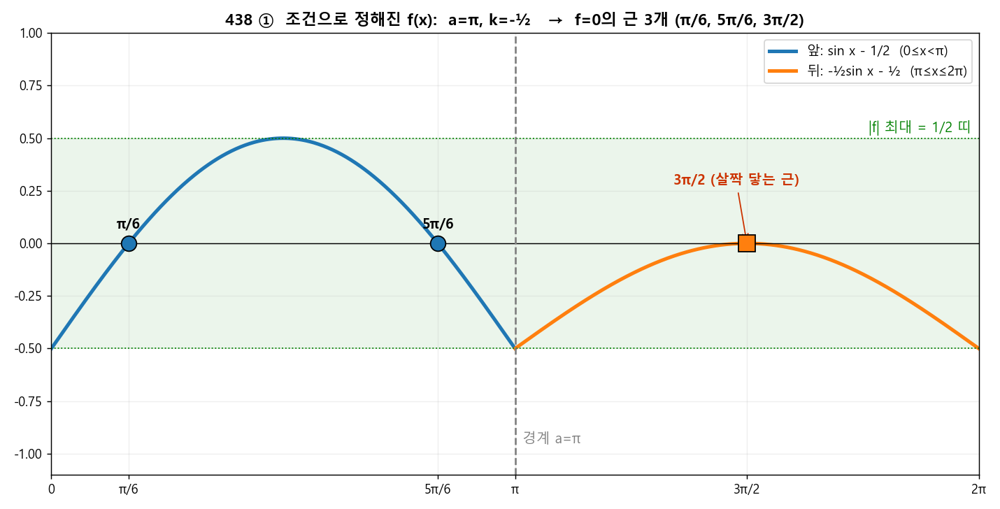
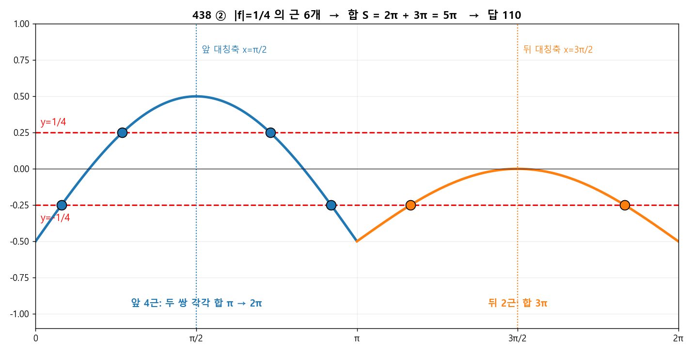

# 🧩 q438  ⭐ 최고난도 (교육청 기출)

> 단원: **삼각함수 — 조건으로 $a,k$ 결정 후 실근 합** · **정답: 110**

## 🔗 원본 (sources, 불변 — 링크만)
- 문제: [사진](https://github.com/fabelian/math-learning-wiki/blob/main/sources/math/2026/06/2026-06-14-q438.jpg)
- 문제 텍스트: [원본 .md](https://github.com/fabelian/math-learning-wiki/blob/main/sources/math/2026/06/2026-06-14-삼각함수-최고난도.md)

## 🎯 문제
$0\le x\le2\pi$에서 $f(x)=\sin x-\frac12\ (0\le x<a)$, $f(x)=k\sin x-\frac12\ (a\le x\le2\pi)$.
(가) $|f|$의 최댓값 $=\frac12$. (나) $f=0$의 실근 3개. → $20\left(\frac{a+S}{\pi}+k\right)$, $S=$ ($|f|=\frac14$의 모든 실근 합).

---

## 🧱 1단계 — (가)로 "$a$의 범위"를 가둔다

$|f|\le\frac12$ 가 **모든 $x$에서** 성립해야 한다.

**앞 조각 $\sin x-\frac12$:** $\left|\sin x-\frac12\right|\le\frac12 \iff 0\le\sin x\le1 \iff \sin x\ge0$.
$\sin x\ge0$은 $[0,\pi]$에서만. 그러니 앞 조각이 덮는 $[0,a)$는 $\pi$를 넘으면 안 된다 → $\boxed{a\le\pi}$.
(만약 $a>\pi$면 $x\in(\pi,a)$에서 $\sin x<0$, $f<-\frac12$ → $|f|>\frac12$ 위반.)

## 🧱 2단계 — (가)로 "$a=\pi$, $k\le0$"까지 좁힌다

**뒤 조각 $k\sin x-\frac12$:** $|k\sin x-\frac12|\le\frac12 \iff 0\le k\sin x\le1$ (뒤 구간 전체에서).

$a\le\pi$이므로 뒤 구간 $[a,2\pi]$는 $(\pi,2\pi)$를 **반드시 포함**(여기 $\sin x<0$).
- $\sin x<0$인 곳에서 $k\sin x\ge0$ 이려면 $k\le0$.
- 그런데 만약 $a<\pi$면 뒤 구간이 $(a,\pi)$도 포함($\sin x>0$). 거기서 $k\le0$이면 $k\sin x-\frac12<-\frac12$ → 위반.

두 요구가 충돌하지 않으려면 뒤 구간에 **$\sin x>0$인 부분이 없어야** 한다 → $\boxed{a=\pi}$ (경계 $x=\pi$는 $\sin=0$이라 무해).

정리: **$a=\pi$, 그리고 $k\le0$.** 추가로 $x=\frac{3\pi}{2}$에서 $\sin=-1$ → $-k\le1$ → $k\ge-1$. 즉 $k\in[-1,0]$.

## 🧱 3단계 — (나)로 "$k=-\frac12$" 확정

$a=\pi$이면:
- **앞 $[0,\pi)$:** $f=0\Rightarrow\sin x=\frac12\Rightarrow x=\frac\pi6,\frac{5\pi}{6}$ → **2개 고정**.
- **뒤 $[\pi,2\pi]$:** $f=0\Rightarrow\sin x=\frac{1}{2k}$ ($k<0$이라 음수).

전체 3개가 되려면 뒤에서 **정확히 1개**. $\sin x=c\ (c<0)$는 $[\pi,2\pi]$에서 보통 2개인데, **$c=-1$일 때만 1개**($x=\frac{3\pi}{2}$).
$$\frac{1}{2k}=-1\ \Rightarrow\ \boxed{k=-\tfrac12}.$$
(검: $k=-1$이면 $\sin x=-\frac12$ → 2개 → 합 4개 ✗. $-\frac12<k<0$이면 $\frac1{2k}<-1$ → 0개 → 2개 ✗. $k=-\frac12$만 OK.)

✔ (가) 재확인: 뒤 조각 $-\frac12\sin x-\frac12=-\frac12(\sin x+1)$, $[\pi,2\pi]$에서 $|f|=\frac12(\sin x+1)\in[0,\frac12]$ ✅.
✔ (나) 실근 $\{\frac\pi6,\frac{5\pi}{6},\frac{3\pi}{2}\}$ — 3개 ✅. ($x=\frac{3\pi}{2}$는 $|f|$가 0에 **접하는** 근.)

> 확정: $a=\pi,\ k=-\dfrac12$. 이제 함수는
> $$f(x)=\begin{cases}\sin x-\frac12 & (0\le x<\pi)\\ -\frac12\sin x-\frac12 & (\pi\le x\le2\pi)\end{cases}$$

> 🖼️ 조건 (가)·(나)로 함수가 딱 하나로 정해진다: **$a=\pi,\ k=-\frac12$**. 초록 띠($|f|\le\frac12$)를 벗어나지 않고, $f=0$이 되는 곳이 **정확히 3군데**(π/6, 5π/6, 그리고 살짝 닿는 3π/2).

## 🧱 4단계 — $|f|=\frac14$의 실근 합 $S$

**앞 $[0,\pi)$:** $\sin x-\frac12=\pm\frac14$.
- $\sin x=\frac34$: 두 해 합 $=\pi$ (해가 $\arcsin\frac34$와 $\pi-\arcsin\frac34$, 합 $\pi$).
- $\sin x=\frac14$: 두 해 합 $=\pi$.
→ 앞에서 4개, 합 $=2\pi$.

**뒤 $[\pi,2\pi]$:** $-\frac12\sin x-\frac12=\pm\frac14$.
- $+\frac14$: $\sin x=-\frac32$ → 해 없음.
- $-\frac14$: $\sin x=-\frac12$ → $x=\frac{7\pi}{6},\frac{11\pi}{6}$, 합 $=3\pi$.
→ 뒤에서 2개, 합 $=3\pi$.

$$S=2\pi+3\pi=\boxed{5\pi}.$$

> 꿀팁: $\sin x=c$의 두 해는 $\theta$와 $\pi-\theta$(또는 $\pi+\,$대칭) → **합이 대칭축의 2배**라 일일이 안 구해도 합이 바로 나온다.

## 🧮 5단계 — 최종 계산
$$20\left(\frac{a+S}{\pi}+k\right)=20\left(\frac{\pi+5\pi}{\pi}+\Big(-\frac12\Big)\right)=20\left(6-\frac12\right)=20\cdot\frac{11}{2}=\boxed{110}.$$

> 🖼️ $|f|=\frac14$은 $y=\pm\frac14$ 두 줄과 만나는 점. **$\sin$의 대칭** 덕분에 근을 일일이 안 구해도 합이 나온다: 앞 4근(두 쌍, 각 합 π) = 2π, 뒤 2근 = 3π → **$S=5\pi$**.

## ✅ 최종 답: **110**

## 🧠 한 줄 교훈
- (가)는 "**$|f|\le\frac12$ ⇒ 각 조각의 부호 제약**"으로 읽어 $a$를 가두는 게 1순위.
- 갈림(분기) 함수는 **경계 $x=a$가 부호 0이 되는 곳**이라는 게 핵심 단서($a=\pi$).
- 실근의 **합**은 $\sin$ 대칭성으로 통째 계산 — 근을 다 구할 필요 없다.

## 🔗 백링크
- 개념: [삼각함수](../concepts/삼각함수.md)
- 같은 세트: [q437](2026-06-14-q437.md) · [q439](2026-06-14-q439.md)
